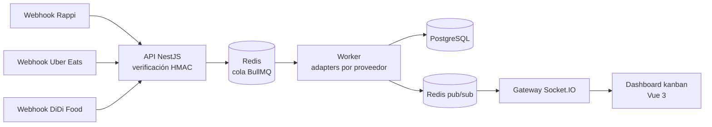

# Delivery Orders Hub

[](https://github.com/haefrain/delivery-orders-hub/actions/workflows/ci.yml)
[](LICENSE)


🇬🇧 [English version](README.md)

Hub de agregación de pedidos de delivery: recibe webhooks simulados de **Rappi**, **Uber Eats** y **DiDi Food**, los normaliza a través de un pipeline asíncrono resiliente (BullMQ + Redis) y los unifica en un dashboard kanban en tiempo real (Vue 3 + Socket.IO).

> 🚧 **En construcción** — desarrollado hito a hito. Cada hito llega con tests y CI en verde.

## ¿Por qué existe?

Cada plataforma de delivery habla un dialecto distinto: payloads, esquemas de firma, monedas y convenciones diferentes. Un restaurante con varias tablets necesita una sola vista unificada. Este proyecto demuestra la arquitectura de integración detrás de ese problema — inspirado en experiencia real en delivery-tech, reconstruido desde cero como showcase público.

## Arquitectura (planeada)



## Estructura del monorepo

| Paquete           | Descripción                                                                 |
| ----------------- | --------------------------------------------------------------------------- |
| `apps/api`        | API de ingesta NestJS + worker asíncrono (dos entrypoints, una sola imagen) |
| `apps/web`        | Dashboard en tiempo real con Vue 3 + Vite + Tailwind                        |
| `packages/shared` | Contratos de dominio compartidos: proveedores, ciclo de vida del pedido     |

## Cómo arrancar

```bash
corepack enable
pnpm install
docker compose up -d   # postgres + redis
pnpm -r build
pnpm test
```

## Roadmap

- [x] **M1** — Esqueleto del monorepo, tooling, pipeline de CI
- [x] **M2** — Modelo canónico de pedido + máquina de estados
- [x] **M3** — Webhooks por proveedor con verificación de firma HMAC
- [x] **M4** — Adapters por proveedor + pipeline worker con BullMQ
- [x] **M5** — Idempotencia + dead-letter queue con endpoints de visibilidad
- [x] **M6** — API de pedidos + transiciones de operador
- [x] **M7** — Dashboard kanban en tiempo real
- [ ] **M8** — Simulador de tráfico, suite e2e completa, docs de arquitectura y GIF demo

## Licencia

[MIT](LICENSE) © Efraín Hernández
