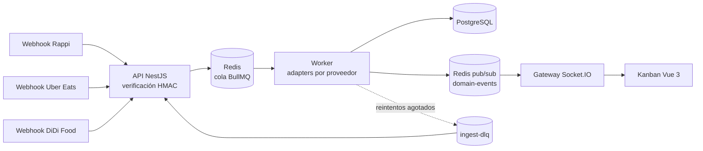
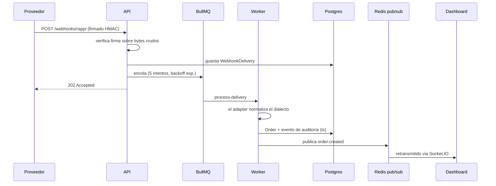
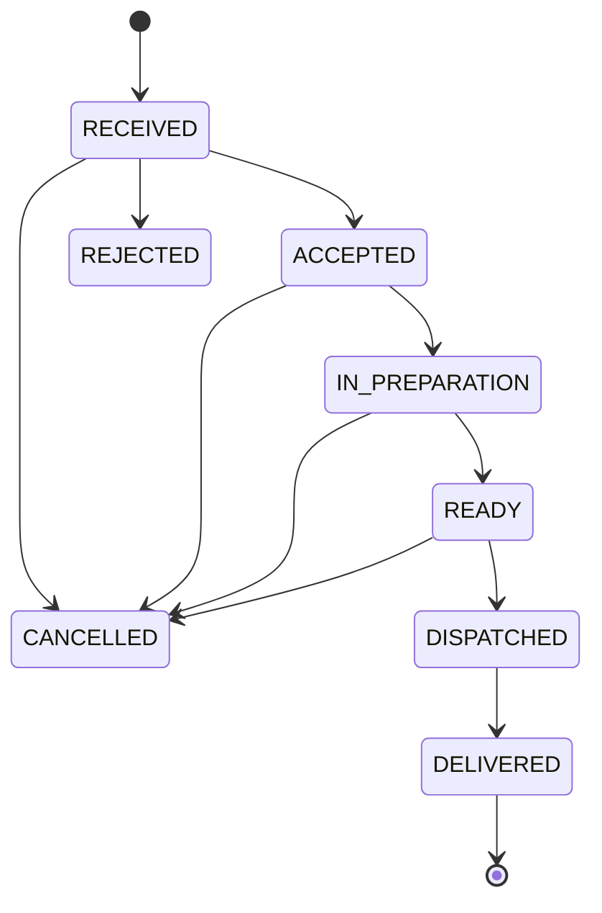

# Delivery Orders Hub

[](https://github.com/haefrain/delivery-orders-hub/actions/workflows/ci.yml)
[](LICENSE)


🇬🇧 [English version](README.md)

Hub de agregación de pedidos de delivery: recibe webhooks simulados de **Rappi**, **Uber Eats** y **DiDi Food** — cada uno con su propio dialecto —, los autentica, los normaliza a través de un pipeline asíncrono resiliente (BullMQ + Redis) y los unifica en un dashboard kanban en tiempo real (Vue 3 + Socket.IO).

> 🎬 **GIF de demo próximamente** — mientras tanto, puedes correrlo completo con los 3 comandos de abajo.

## ¿Por qué existe?

Cada plataforma de delivery habla distinto: formas de payload, esquemas de firma, monedas, incluso _JSON embebido dentro de strings JSON_ (sí, DiDi). Un restaurante con tres tablets necesita una sola vista. Este proyecto demuestra la arquitectura de integración detrás de ese problema — inspirado en experiencia real en delivery-tech, reconstruido desde cero como showcase público.

## Arranque rápido

```bash
docker compose up -d --build          # postgres, redis, api, worker, dashboard
open http://localhost:8080            # el tablero kanban en vivo
pnpm install && pnpm build            # una vez, para el simulador de tráfico
pnpm --filter @delivery-hub/api simulate -- --count 20 --rate 2
```

Mira cómo los pedidos de tres plataformas aterrizan y se mueven por el tablero en tiempo real.

## Arquitectura



API y worker son **una unidad de código, dos unidades de despliegue**: la misma imagen corre `dist/main.js` (HTTP + websockets) y `dist/worker.main.js` (consumidor de la cola). El API solo verifica, persiste y encola — un pico de tráfico jamás bloquea el endpoint de webhooks.



### Ciclo de vida del pedido



La tabla de transiciones vive en [`packages/shared`](packages/shared/src/order-transitions.ts) y la consumen **ambos** lados: el API la aplica ([`OrderStateMachine`](apps/api/src/orders/domain/order-state-machine.ts), 74 tests table-driven que cubren los 64 pares de estados) y el dashboard pinta los botones de acción desde ella — la UI no puede ofrecer un movimiento que el servidor rechazaría.

## Patrones de diseño y SOLID, mapeados al código

| Pieza                                                                                                                                                | Patrón                        | Principio que demuestra                                                                    |
| ---------------------------------------------------------------------------------------------------------------------------------------------------- | ----------------------------- | ------------------------------------------------------------------------------------------ |
| [`WebhooksController`](apps/api/src/webhooks/webhooks.controller.ts) — verifica, encola, 202; cero lógica de negocio                                 | Controller delgado / Producer | **SRP** — ingreso ≠ procesamiento                                                          |
| [`SignatureVerifier`](apps/api/src/webhooks/verifiers/signature-verifier.interface.ts) por proveedor (hex vs base64, con o sin timestamp)            | Strategy                      | **OCP** en la capa de seguridad                                                            |
| [`ProviderAdapter`](apps/api/src/providers/provider-adapter.interface.ts) + 3 implementaciones para 3 dialectos genuinamente distintos               | Adapter                       | **LSP** — probado con [tests de contrato](apps/api/src/providers/adapter.contract.spec.ts) |
| [`AdapterRegistry`](apps/api/src/providers/adapter.registry.ts) — plataforma nueva = 1 clase + [1 línea](apps/api/src/providers/providers.module.ts) | Registry                      | **OCP / DIP** — el worker jamás importa un adapter concreto                                |
| Verifiers y adapters como interfaces separadas                                                                                                       | —                             | **ISP** — el guard no sabe nada de normalización                                           |
| [`OrderStateMachine`](apps/api/src/orders/domain/order-state-machine.ts) — pura, sin framework                                                       | State (tabla de transiciones) | **SRP** — reglas de negocio sin I/O                                                        |
| Puerto [`OrdersRepository`](apps/api/src/orders/orders.repository.ts) + implementación Prisma                                                        | Repository                    | **DIP** — la capa de servicio nunca importa Prisma                                         |
| Puerto [`DomainEventPublisher`](apps/api/src/realtime/domain-event-publisher.ts) + bridge Redis                                                      | Pub/Sub                       | **DIP** — el transporte realtime es un detalle intercambiable                              |
| Constraints únicos + [manejo de `P2002`](apps/api/src/ingestion/ingest.processor.ts) + DLQ                                                           | —                             | Resiliencia por diseño                                                                     |

## Decisiones (ADR-lite)

Registros cortos de las decisiones no obvias, en [`docs/adr/`](docs/adr) (en inglés):

- [0001 — Monorepo con pnpm workspaces](docs/adr/0001-monorepo-with-pnpm-workspaces.md)
- [0002 — Dinero como enteros en unidad mínima](docs/adr/0002-money-as-integer-minor-units.md)
- [0003 — Bridge Redis pub/sub para realtime](docs/adr/0003-redis-pubsub-bridge-for-realtime.md)
- [0004 — DLQ artesanal sobre BullMQ](docs/adr/0004-hand-rolled-dlq-on-bullmq.md)
- [0005 — Idempotencia por constraint de base de datos](docs/adr/0005-idempotency-by-database-constraint.md)
- [0006 — Service containers en vez de Testcontainers](docs/adr/0006-service-containers-over-testcontainers.md)

## Prueba la resiliencia tú mismo

Estas propiedades no se ven en un screenshot — por eso son reproducibles:

**Webhook duplicado → un solo pedido.** Envía el mismo payload firmado dos veces; ambos reciben `202` con el _mismo_ `deliveryId` y existe un solo pedido. (Dedup a nivel de entrega: constraint único sobre `sha256(rawBody)`.)

**Payload corrupto → dead-letter queue.** Un payload firmado pero malformado se acepta en el borde (`202`), falla rápido en el worker (`UnrecoverableError`, sin reintentos inútiles) y aterriza en la DLQ con la razón legible:

```bash
curl -s localhost:3000/dlq | jq
# { "count": 1, "jobs": [ { "deliveryId": "...", "error": "Invalid RAPPI payload: ..." } ] }
curl -s -X POST localhost:3000/dlq/<id>/retry   # reencolar tras corregir la causa
```

**Mata el worker y sigue ingiriendo.** `docker compose stop worker`, corre el simulador (los webhooks siguen respondiendo `202`), luego `docker compose start worker` — el backlog se drena y el tablero se pone al día.

**Transición ilegal → 409.** `PATCH /orders/:id/transition {"to":"DELIVERED"}` sobre un pedido `RECEIVED` devuelve `409 Invalid order transition: RECEIVED -> DELIVERED` directo desde el dominio.

## Testing

~160 tests en tres capas, todo en verde en [CI](https://github.com/haefrain/delivery-orders-hub/actions):

| Capa                 | Qué cubre                                                                                                                | Infra                                       |
| -------------------- | ------------------------------------------------------------------------------------------------------------------------ | ------------------------------------------- |
| Unit (Jest + Vitest) | máquina de estados (los 64 pares), adapters, verifiers HMAC, autoconsistencia del simulador, store de Pinia, componentes | ninguna                                     |
| Integración (Jest)   | idempotencia del processor, semántica de la DLQ, API de pedidos sobre HTTP real, relay Redis→Socket.IO                   | Postgres + Redis reales                     |
| Flujo completo       | webhook firmado → cola real → worker real → Postgres; payload corrupto → DLQ                                             | todo real, `waitUntilFinished`, cero sleeps |

```bash
pnpm test                  # suites unit + capa HTTP
docker compose up -d postgres redis
pnpm test:integration      # las suites que de verdad valen
```

El simulador se testea por **autoconsistencia**: cada payload aleatorio que emite debe pasar por el mismo verifier y adapter que usa el pipeline de producción.

## Fuera de alcance (a propósito)

Sin auth/multi-tenant (un restaurante fijo), sin llamadas salientes a proveedores, sin event sourcing (`OrderEvent` es auditoría), sin Kafka (BullMQ cubre este volumen; ver ADR 0004), sin drag & drop, sin k8s. Cada recorte mantiene el foco en la arquitectura de integración que este repo existe para demostrar.

**Roadmap:** demo pública desplegada · simulación de aceptación saliente al proveedor · panel de operación con `@bull-board` · rate limiting por proveedor.

## Licencia

[MIT](LICENSE) © Efraín Hernández
