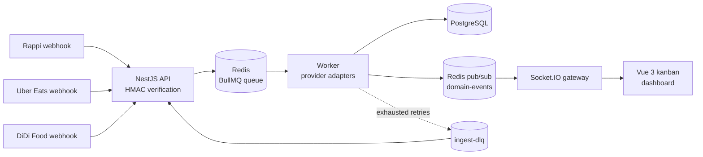
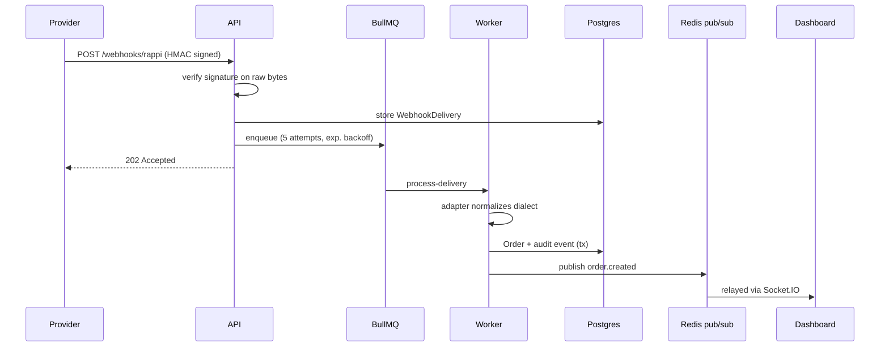
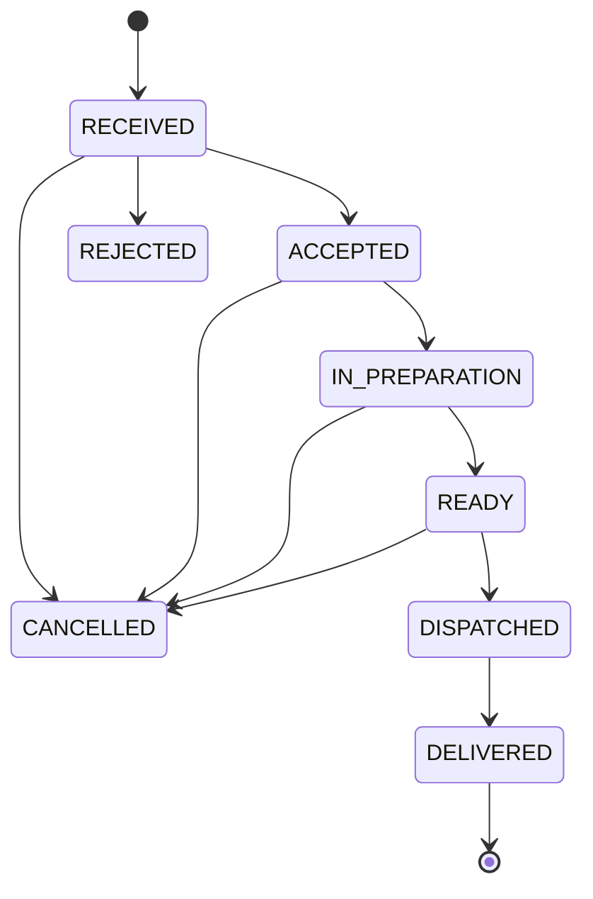

# Delivery Orders Hub

[](https://github.com/haefrain/delivery-orders-hub/actions/workflows/ci.yml)
[](LICENSE)


🇪🇸 [Versión en español](README.es.md)

A delivery order aggregation hub: it ingests simulated webhooks from **Rappi**, **Uber Eats** and **DiDi Food** — each speaking its own dialect — authenticates them, normalizes them through a resilient async pipeline (BullMQ + Redis), and unifies everything into a real-time kanban dashboard (Vue 3 + Socket.IO).

> 🎬 **Demo GIF coming soon** — meanwhile, run the whole thing yourself with the 3 commands below.

## Why this exists

Every delivery platform speaks a different dialect: payload shapes, signature schemes, currencies, even _JSON embedded inside JSON strings_ (looking at you, DiDi). Restaurants juggling three tablets need one unified view. This project demonstrates the integration architecture behind that problem — inspired by real-world delivery-tech work at scale, rebuilt from scratch as a public showcase.

## Quick start

```bash
docker compose up -d --build          # postgres, redis, api, worker, dashboard
open http://localhost:8080            # the live kanban board
pnpm install && pnpm build            # one-time, for the traffic simulator
pnpm --filter @delivery-hub/api simulate -- --count 20 --rate 2
```

Watch orders from three platforms land and move across the board in real time.

## Architecture



The API and the worker are **one code unit, two deployment units**: the same image runs `dist/main.js` (HTTP + websockets) and `dist/worker.main.js` (queue consumer). The API only verifies, persists and enqueues — a provider outage spike can never block the webhook endpoint.



### Order lifecycle



The transition table lives in [`packages/shared`](packages/shared/src/order-transitions.ts) and is consumed by **both** sides: the API enforces it ([`OrderStateMachine`](apps/api/src/orders/domain/order-state-machine.ts), 74 table-driven tests covering all 64 status pairs) and the dashboard renders action buttons from it — the UI cannot offer a move the server would reject.

## Design patterns & SOLID, mapped to code

| Piece                                                                                                                                           | Pattern                    | Principle it demonstrates                                                             |
| ----------------------------------------------------------------------------------------------------------------------------------------------- | -------------------------- | ------------------------------------------------------------------------------------- |
| [`WebhooksController`](apps/api/src/webhooks/webhooks.controller.ts) — verify, enqueue, 202; zero business logic                                | Thin controller / Producer | **SRP** — ingress ≠ processing                                                        |
| [`SignatureVerifier`](apps/api/src/webhooks/verifiers/signature-verifier.interface.ts) per provider (hex vs base64, timestamped vs plain)       | Strategy                   | **OCP** at the security layer                                                         |
| [`ProviderAdapter`](apps/api/src/providers/provider-adapter.interface.ts) + 3 implementations for 3 genuinely different dialects                | Adapter                    | **LSP** — proven by [contract tests](apps/api/src/providers/adapter.contract.spec.ts) |
| [`AdapterRegistry`](apps/api/src/providers/adapter.registry.ts) — new platform = 1 class + [1 line](apps/api/src/providers/providers.module.ts) | Registry                   | **OCP / DIP** — the worker never imports a concrete adapter                           |
| Verifiers and adapters as separate interfaces                                                                                                   | —                          | **ISP** — the guard knows nothing about normalization                                 |
| [`OrderStateMachine`](apps/api/src/orders/domain/order-state-machine.ts) — pure, framework-free                                                 | State (transition table)   | **SRP** — business rules without I/O                                                  |
| [`OrdersRepository`](apps/api/src/orders/orders.repository.ts) port + Prisma implementation                                                     | Repository                 | **DIP** — the service layer never imports Prisma                                      |
| [`DomainEventPublisher`](apps/api/src/realtime/domain-event-publisher.ts) port + Redis bridge                                                   | Pub/Sub                    | **DIP** — realtime transport is a swappable detail                                    |
| Unique constraints + [`P2002` handling](apps/api/src/ingestion/ingest.processor.ts) + DLQ                                                       | —                          | Resilience by design                                                                  |

## Decisions (ADR-lite)

Short records of the non-obvious choices, in [`docs/adr/`](docs/adr):

- [0001 — Monorepo with pnpm workspaces](docs/adr/0001-monorepo-with-pnpm-workspaces.md)
- [0002 — Money as integer minor units](docs/adr/0002-money-as-integer-minor-units.md)
- [0003 — Redis pub/sub bridge for realtime](docs/adr/0003-redis-pubsub-bridge-for-realtime.md)
- [0004 — Hand-rolled DLQ on BullMQ](docs/adr/0004-hand-rolled-dlq-on-bullmq.md)
- [0005 — Idempotency by database constraint](docs/adr/0005-idempotency-by-database-constraint.md)
- [0006 — Service containers over Testcontainers](docs/adr/0006-service-containers-over-testcontainers.md)

## Try the resilience yourself

These properties are invisible in a screenshot — so they're reproducible instead:

**Duplicate webhook → one order.** Send the same signed payload twice; both get `202` with the _same_ `deliveryId`, one order exists. (Delivery-level dedup: `sha256(rawBody)` unique constraint.)

**Corrupt payload → dead-letter queue.** A signed-but-malformed payload is accepted at the edge (`202`), fails fast in the worker (`UnrecoverableError`, no pointless retries) and lands in the DLQ with a readable reason:

```bash
curl -s localhost:3000/dlq | jq
# { "count": 1, "jobs": [ { "deliveryId": "...", "error": "Invalid RAPPI payload: ..." } ] }
curl -s -X POST localhost:3000/dlq/<id>/retry   # requeue after fixing the cause
```

**Kill the worker, keep ingesting.** `docker compose stop worker`, run the simulator (webhooks still return `202`), then `docker compose start worker` — the backlog drains and the board catches up.

**Illegal transition → 409.** `PATCH /orders/:id/transition {"to":"DELIVERED"}` on a `RECEIVED` order returns `409 Invalid order transition: RECEIVED -> DELIVERED` straight from the domain.

## Testing

~160 tests across three layers, all green in [CI](https://github.com/haefrain/delivery-orders-hub/actions):

| Layer                | What it covers                                                                                              | Infra                                             |
| -------------------- | ----------------------------------------------------------------------------------------------------------- | ------------------------------------------------- |
| Unit (Jest + Vitest) | state machine (all 64 pairs), adapters, HMAC verifiers, simulator self-consistency, Pinia store, components | none                                              |
| Integration (Jest)   | processor idempotency, DLQ semantics, orders API over real HTTP, Redis→Socket.IO relay                      | real Postgres + Redis                             |
| Full flow            | signed webhook → real queue → real worker → Postgres; corrupt payload → DLQ                                 | everything real, `waitUntilFinished`, zero sleeps |

```bash
pnpm test                  # unit + HTTP-layer suites
docker compose up -d postgres redis
pnpm test:integration      # the suites that earn their keep
```

The simulator is tested for **self-consistency**: every random payload it emits must pass the same verifier and adapter the production pipeline uses.

## Out of scope (on purpose)

No auth/multi-tenancy (one hardcoded restaurant), no outbound calls to providers, no event sourcing (`OrderEvent` is an audit trail), no Kafka (BullMQ covers this volume; see ADR 0004), no drag & drop, no k8s. Each cut keeps the focus on the integration architecture this repo exists to demonstrate.

**Roadmap:** public deployed demo · outbound order acceptance simulation · `@bull-board` ops panel · per-provider rate limiting.

## License

[MIT](LICENSE) © Efraín Hernández
