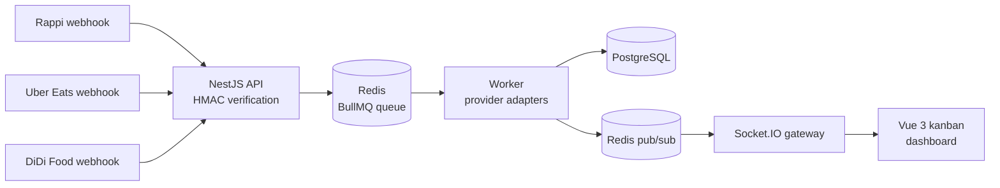

# Delivery Orders Hub

[](https://github.com/haefrain/delivery-orders-hub/actions/workflows/ci.yml)
[](LICENSE)


🇪🇸 [Versión en español](README.es.md)

A delivery order aggregation hub: it ingests simulated webhooks from **Rappi**, **Uber Eats** and **DiDi Food**, normalizes them through a resilient async pipeline (BullMQ + Redis), and unifies them into a real-time kanban dashboard (Vue 3 + Socket.IO).

> 🚧 **Work in progress** — built milestone by milestone. Each milestone lands with green tests and CI.

## Why this exists

Every delivery platform speaks a different dialect: different payload shapes, signature schemes, currencies and conventions. Restaurants juggling multiple tablets need one unified view. This project demonstrates the integration architecture behind that problem — inspired by real-world delivery-tech work, rebuilt from scratch as a public showcase.

## Architecture (planned)



## Monorepo layout

| Package           | Description                                                                 |
| ----------------- | --------------------------------------------------------------------------- |
| `apps/api`        | NestJS ingestion API + async worker (two entrypoints, one deployable image) |
| `apps/web`        | Vue 3 + Vite + Tailwind real-time dashboard                                 |
| `packages/shared` | Domain contracts shared by back and front: providers, order lifecycle       |

## Getting started

```bash
corepack enable
pnpm install
docker compose up -d   # postgres + redis
pnpm -r build
pnpm test
```

## Roadmap

- [x] **M1** — Monorepo skeleton, tooling, CI pipeline
- [x] **M2** — Canonical order model + order state machine
- [ ] **M3** — Provider webhooks with HMAC signature verification
- [ ] **M4** — Provider adapters + BullMQ worker pipeline
- [ ] **M5** — Idempotency + dead-letter queue with visibility endpoints
- [ ] **M6** — Orders API + operator transitions
- [ ] **M7** — Real-time kanban dashboard
- [ ] **M8** — Traffic simulator, full e2e suite, architecture docs & demo GIF

## License

[MIT](LICENSE) © Efraín Hernández
